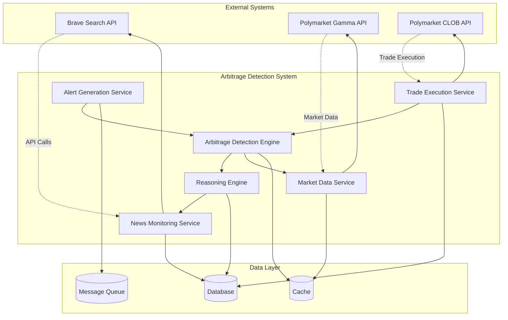
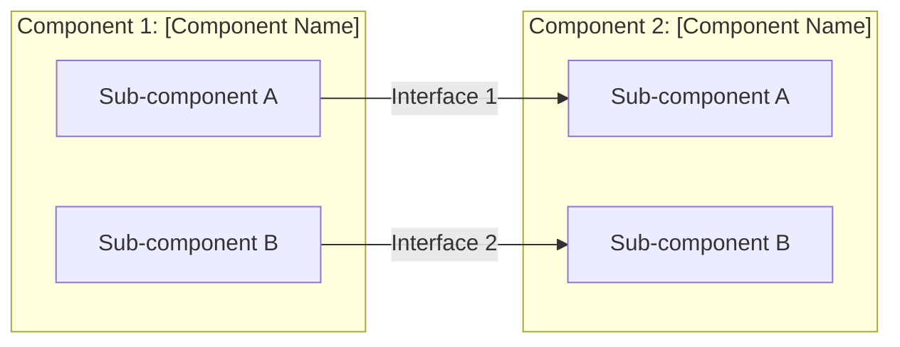
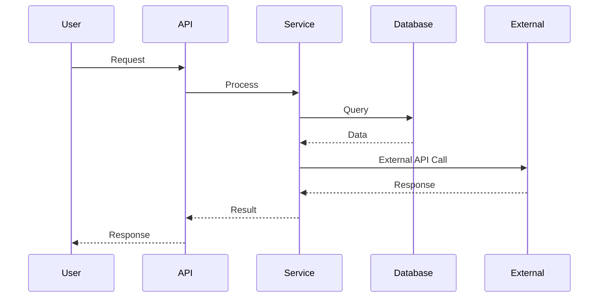
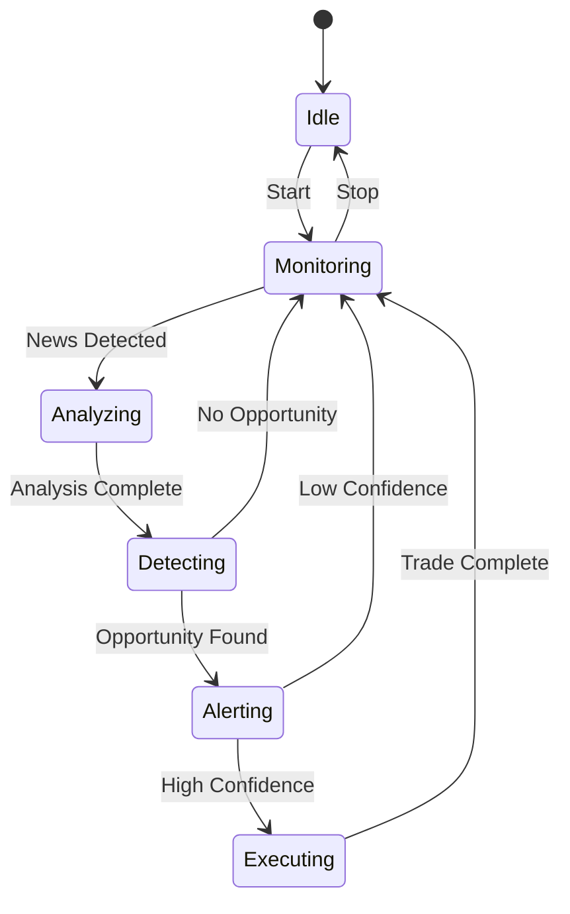
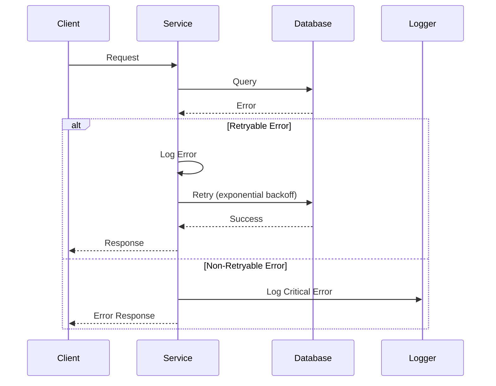

# System Architecture Diagrams

This document contains templates for various architecture diagrams using Mermaid syntax.

## High-Level System Architecture



## Component Diagram



## Data Flow Diagram



## State Machine Diagram



## Entity-Relationship Diagram

```mermaid
erDiagram
    ENTITY1 ||--o{ ENTITY2 : "relationship name"
    ENTITY1 {
        id PK
        field1 type
        field2 type
        created_at timestamp
    }
    ENTITY2 {
        id PK
        entity1_id FK
        field1 type
        field2 type
    }
```

## Deployment Architecture

```mermaid
graph TB
    subgraph "Load Balancer"
        LB[Load Balancer]
    end

    subgraph "Application Servers"
        APP1[App Server 1]
        APP2[App Server 2]
        APP3[App Server 3]
    end

    subgraph "Database Layer"
        DB Primary[(Primary DB)]
        DB Replica1[(Replica 1)]
        DB Replica2[(Replica 2)]
    end

    subgraph "Cache Layer"
        Cache1[(Cache 1)]
        Cache2[(Cache 2)]
    end

    LB --> APP1
    LB --> APP2
    LB --> APP3

    APP1 --> Cache1
    APP2 --> Cache2
    APP3 --> Cache1

    APP1 --> DB Primary
    APP2 --> DB Primary
    APP3 --> DB Primary

    DB Primary --> DB Replica1
    DB Primary --> DB Replica2
```

## Sequence Diagram for Error Handling



## Usage Instructions

1. Copy the appropriate template
2. Replace placeholder text with actual component names
3. Adjust relationships and data flow
4. Add or remove components as needed
5. Include diagram in architecture documentation

## Best Practices

- Keep diagrams simple and focused
- Use consistent naming conventions
- Label all relationships and data flows
- Include error handling paths where relevant
- Use appropriate diagram type for your purpose
- Update diagrams when architecture changes
