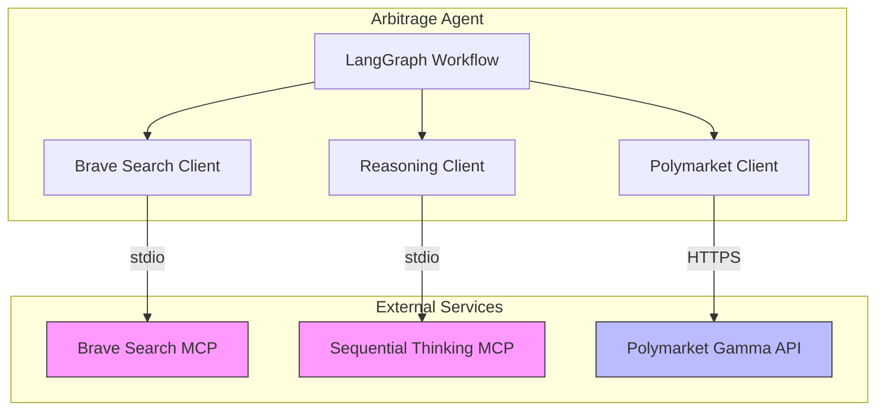

# MVP API Integration Patterns

## Overview

This document describes how the MVP integrates with external APIs and MCP servers, including authentication, rate limiting, error handling, and data transformation patterns.

## Integration Architecture



## MCP Integration Pattern

### MCP Client Base Class

All MCP clients follow this pattern:

```python
from abc import ABC, abstractmethod
import asyncio
import json
from typing import Any

class MCPClient(ABC):
    """Base class for MCP client integrations."""

    def __init__(self, server_name: str):
        self.server_name = server_name

    @abstractmethod
    async def call(self, method: str, params: dict[str, Any]) -> Any:
        """Call MCP method with parameters."""
        pass

    async def call_with_retry(
        self,
        method: str,
        params: dict[str, Any],
        max_retries: int = 3,
        base_delay: float = 1.0
    ) -> Any:
        """Call MCP method with retry logic."""
        for attempt in range(max_retries):
            try:
                return await self.call(method, params)
            except Exception as e:
                if attempt == max_retries - 1:
                    raise
                delay = base_delay * (2 ** attempt)
                logger.warning(
                    "mcp_retry",
                    server=self.server_name,
                    method=method,
                    attempt=attempt + 1,
                    delay=delay,
                    error=str(e)
                )
                await asyncio.sleep(delay)
```

### Brave Search MCP Integration

**Implementation**: `src/tools/brave_search_client.py`

```python
import structlog
from typing import Optional

logger = structlog.get_logger()

class BraveSearchClient(MCPClient):
    """Client for Brave Search MCP."""

    def __init__(self):
        super().__init__("brave-search")
        self.timeout = 30  # seconds

    async def search(
        self,
        query: str,
        count: int = 10,
        freshness: str = "pd",
        offset: int = 0
    ) -> list[NewsArticle]:
        """
        Search for news using Brave Search MCP.

        Args:
            query: Search query string
            count: Number of results (1-50)
            freshness: Time filter - "pd" (day), "pw" (week), "pm" (month)
            offset: Pagination offset

        Returns:
            List of NewsArticle objects

        Raises:
            MCPError: If MCP call fails
        """
        try:
            response = await self.call_with_retry(
                method="brave_search.search",
                params={
                    "query": query,
                    "count": count,
                    "freshness": freshness,
                    "offset": offset
                }
            )

            # Transform response to NewsArticle objects
            articles = []
            for result in response.get("results", []):
                article = NewsArticle(
                    url=result["url"],
                    title=result.get("title", ""),
                    summary=result.get("snippet", ""),
                    published_date=self._parse_date(result.get("age")),
                    source=result.get("meta_url", {}).get("hostname")
                )
                articles.append(article)

            logger.info(
                "brave_search_success",
                query=query,
                results=len(articles)
            )

            return articles

        except Exception as e:
            logger.error(
                "brave_search_error",
                query=query,
                error=str(e),
                error_type=type(e).__name__
            )
            raise

    def _parse_date(self, age_str: Optional[str]) -> Optional[datetime]:
        """Parse Brave Search age string to datetime."""
        if not age_str:
            return None

        # Parse strings like "2 hours ago", "1 day ago"
        # Implementation depends on Brave Search API format
        # For now, return None and default to fetched_at
        return None

    # In actual implementation, call() would communicate with MCP server via stdio
    async def call(self, method: str, params: dict[str, Any]) -> Any:
        """Call Brave Search MCP method."""
        # This is a placeholder - actual implementation depends on MCP SDK
        # The MCP SDK will handle stdio communication
        pass
```

**Configuration**:

```python
# Environment variables
BRAVE_API_KEY: str  # Required - Brave Search API key
BRAVE_SEARCH_TIMEOUT: int = 30  # Request timeout in seconds
BRAVE_MAX_RETRIES: int = 3  # Max retry attempts
```

**Error Handling**:

| Error | Handling |
|-------|----------|
| Network timeout | Retry with exponential backoff |
| Rate limit (429) | Wait and retry (up to 3 attempts) |
| Invalid API key | Fail fast, log error |
| No results | Return empty list |

### Sequential Thinking MCP Integration

**Implementation**: `src/tools/reasoning_client.py`

```python
class ReasoningClient(MCPClient):
    """Client for Sequential Thinking MCP."""

    def __init__(self):
        super().__init__("sequential-thinking")
        self.timeout = 30  # seconds

    async def analyze_impact(
        self,
        news_article: NewsArticle,
        market: Market
    ) -> MarketImpact:
        """
        Analyze news impact on a market.

        Args:
            news_article: News article to analyze
            market: Market to assess impact on

        Returns:
            MarketImpact assessment

        Raises:
            MCPError: If MCP call fails
        """
        try:
            # Prepare context
            context = self._prepare_context(news_article, market)

            response = await self.call_with_retry(
                method="sequential_thinking.reason",
                params={
                    "news_article": news_article.summary,
                    "market_description": f"{market.question}. {market.description}",
                    "market_end_date": market.end_date.isoformat() if market.end_date else None,
                    "context": context
                }
            )

            # Transform response to MarketImpact
            impact = MarketImpact(
                id=f"impact-{datetime.utcnow().timestamp()}-{news_article.url}-{market.market_id}",
                news_url=news_article.url,
                market_id=market.market_id,
                relevance=response["relevance"],
                direction=PriceDirection(response["direction"]),
                confidence=response["confidence"],
                reasoning=response["reasoning"],
                expected_magnitude=response["expected_magnitude"],
                expected_price=response["expected_price"]
            )

            logger.info(
                "reasoning_success",
                market_id=market.market_id,
                relevance=impact.relevance,
                confidence=impact.confidence
            )

            return impact

        except Exception as e:
            logger.error(
                "reasoning_error",
                market_id=market.market_id,
                news_url=str(news_article.url),
                error=str(e)
            )
            # Return neutral impact on error
            return self._create_neutral_impact(news_article, market, str(e))

    def _prepare_context(self, news: NewsArticle, market: Market) -> str:
        """Prepare context for reasoning."""
        return f"""
Analyze the impact of this news on the prediction market.

News Article:
Title: {news.title}
Summary: {news.summary}
Published: {news.published_date or 'Unknown'}

Market:
Question: {market.question}
Description: {market.description}
End Date: {market.end_date or 'Open-ended'}

Assess:
1. Relevance (0-1): How relevant is this news to the market?
2. Direction (up/down/neutral): Which way should the price move?
3. Confidence (0-1): How confident are you in this assessment?
4. Reasoning: Explain your reasoning in 2-3 sentences.
5. Magnitude (0-1): Expected price change magnitude.
"""

    def _create_neutral_impact(
        self,
        news: NewsArticle,
        market: Market,
        error: str
    ) -> MarketImpact:
        """Create neutral impact when reasoning fails."""
        return MarketImpact(
            id=f"impact-neutral-{datetime.utcnow().timestamp()}",
            news_url=news.url,
            market_id=market.market_id,
            relevance=0.0,
            direction=PriceDirection.NEUTRAL,
            confidence=0.0,
            reasoning=f"Failed to analyze: {error}",
            expected_magnitude=0.0,
            expected_price=0.0
        )

    async def call(self, method: str, params: dict[str, Any]) -> Any:
        """Call Sequential Thinking MCP method."""
        # Placeholder - actual implementation via MCP SDK
        pass
```

**Configuration**:

```python
# Environment variables
SEQUENTIAL_THINKING_TIMEOUT: int = 30  # Request timeout
SEQUENTIAL_MAX_RETRIES: int = 1  # Don't retry reasoning (fail fast)
```

**Error Handling**:

| Error | Handling |
|-------|----------|
| Timeout | Fail fast, return neutral impact |
| Invalid response | Fail fast, return neutral impact |
| MCP unavailable | Log warning, continue without reasoning |

## Polymarket Gamma API Integration

### HTTP Client Base

```python
import httpx
from tenacity import retry, stop_after_attempt, wait_exponential
from typing import Optional

class PolymarketGammaClient:
    """Client for Polymarket Gamma API."""

    def __init__(
        self,
        base_url: str = "https://gamma-api.polymarket.com",
        timeout: int = 30
    ):
        self.base_url = base_url.rstrip("/")
        self.timeout = timeout

        # Create async HTTP client with rate limiting
        self.client = httpx.AsyncClient(
            base_url=self.base_url,
            timeout=timeout,
            headers={
                "User-Agent": "PolymarketArbitrageAgent/0.1.0",
                "Accept": "application/json"
            }
        )

    async def close(self):
        """Close the HTTP client."""
        await self.client.aclose()

    async def __aenter__(self):
        """Async context manager entry."""
        return self

    async def __aexit__(self, exc_type, exc_val, exc_tb):
        """Async context manager exit."""
        await self.close()

    @retry(
        stop=stop_after_attempt(3),
        wait=wait_exponential(multiplier=1, min=1, max=10)
    )
    async def _request(
        self,
        method: str,
        endpoint: str,
        params: Optional[dict] = None,
        **kwargs
    ) -> dict:
        """Make HTTP request with retry logic."""
        url = f"{self.base_url}/{endpoint.lstrip('/')}"

        try:
            response = await self.client.request(
                method,
                url,
                params=params,
                **kwargs
            )
            response.raise_for_status()
            return response.json()

        except httpx.HTTPStatusError as e:
            logger.error(
                "http_error",
                endpoint=endpoint,
                status=e.response.status_code,
                response=e.response.text
            )
            raise

        except httpx.NetworkError as e:
            logger.error(
                "network_error",
                endpoint=endpoint,
                error=str(e)
            )
            raise
```

### Market Data Endpoints

```python
class PolymarketGammaClient:
    # ... (previous code)

    async def get_markets(
        self,
        active: bool = True,
        limit: int = 100,
        offset: int = 0
    ) -> list[Market]:
        """
        Fetch list of markets.

        Args:
            active: Filter for active/inactive markets
            limit: Maximum results
            offset: Pagination offset

        Returns:
            List of Market objects
        """
        try:
            data = await self._request(
                "GET",
                "/markets",
                params={
                    "active": str(active).lower(),
                    "limit": limit,
                    "offset": offset
                }
            )

            markets = []
            for market_data in data.get("data", []):
                market = Market(
                    market_id=str(market_data["condition_id"]),
                    question=market_data["question"],
                    description=market_data.get("description", ""),
                    end_date=self._parse_end_date(market_data),
                    active=market_data.get("active", True),
                    yes_token_id=str(market_data.get("outcome_token_id_yes", "")),
                    no_token_id=str(market_data.get("outcome_token_id_no", "")),
                    tags=market_data.get("tags", [])
                )
                markets.append(market)

            logger.info(
                "markets_fetched",
                count=len(markets),
                active=active
            )

            return markets

        except Exception as e:
            logger.error("fetch_markets_error", error=str(e))
            raise

    async def get_price(self, token_id: str, side: str = "buy") -> float:
        """
        Fetch current price for a token.

        Args:
            token_id: Token identifier
            side: "buy" or "sell"

        Returns:
            Current price (0.0-1.0)
        """
        try:
            data = await self._request(
                "GET",
                f"/price/{token_id}",
                params={"side": side}
            )

            price = float(data.get("price", 0.0))

            logger.debug(
                "price_fetched",
                token_id=token_id,
                side=side,
                price=price
            )

            return price

        except Exception as e:
            logger.error(
                "fetch_price_error",
                token_id=token_id,
                side=side,
                error=str(e)
            )
            raise

    async def get_order_book(self, token_id: str) -> dict:
        """
        Fetch order book for a token.

        Args:
            token_id: Token identifier

        Returns:
            Order book with bids and asks
        """
        try:
            data = await self._request(
                "GET",
                f"/book/{token_id}"
            )

            return {
                "bids": data.get("bids", []),
                "asks": data.get("asks", [])
            }

        except Exception as e:
            logger.error(
                "fetch_order_book_error",
                token_id=token_id,
                error=str(e)
            )
            raise

    def _parse_end_date(self, market_data: dict) -> Optional[datetime]:
        """Parse end date from market data."""
        end_timestamp = market_data.get("end_date")
        if end_timestamp:
            return datetime.fromtimestamp(end_timestamp / 1000)
        return None
```

### Rate Limiting

```python
from asyncio import Semaphore
import time

class RateLimitedClient(PolymarketGammaClient):
    """Polymarket client with rate limiting."""

    def __init__(self, requests_per_second: int = 10, **kwargs):
        super().__init__(**kwargs)
        self.rate_limit = requests_per_second
        self.semaphore = Semaphore(requests_per_second)
        self.request_times = []

    async def _request(self, method: str, endpoint: str, **kwargs) -> dict:
        """Make rate-limited request."""
        async with self.semaphore:
            # Enforce rate limit
            now = time.time()
            self.request_times = [t for t in self.request_times if now - t < 1.0]

            if len(self.request_times) >= self.rate_limit:
                sleep_time = 1.0 - (now - self.request_times[0])
                if sleep_time > 0:
                    await asyncio.sleep(sleep_time)
                self.request_times = []

            self.request_times.append(now)

            return await super()._request(method, endpoint, **kwargs)
```

**Configuration**:

```python
# Environment variables
POLYMARKET_GAMMA_HOST: str = "gamma-api.polymarket.com"
POLYMARKET_TIMEOUT: int = 30  # Request timeout
POLYMARKET_RATE_LIMIT: int = 10  # Requests per second
POLYMARKET_MAX_RETRIES: int = 3  # Retry attempts
```

## Data Transformation Patterns

### API Response → Internal Model

```python
def transform_market(api_response: dict) -> Market:
    """Transform API response to Market model."""
    return Market(
        market_id=str(api_response["condition_id"]),
        question=api_response["question"],
        description=api_response.get("description", ""),
        end_date=parse_timestamp(api_response.get("end_date")),
        active=api_response.get("active", True),
        yes_token_id=str(api_response["outcome_token_id_yes"]),
        no_token_id=str(api_response["outcome_token_id_no"]),
        tags=api_response.get("tags", [])
    )
```

### Internal Model → JSON Export

```python
def alert_to_json(alert: Alert) -> dict:
    """Convert alert to JSON-serializable dict."""
    return {
        "id": alert.id,
        "severity": alert.severity.value,
        "title": alert.title,
        "message": alert.message,
        "news_url": str(alert.news_url),
        "news_title": alert.news_title,
        "market_id": alert.market_id,
        "market_question": alert.market_question,
        "current_price": alert.current_price,
        "expected_price": alert.expected_price,
        "discrepancy": round(alert.discrepancy, 4),
        "confidence": round(alert.confidence, 4),
        "recommended_action": alert.recommended_action,
        "timestamp": alert.timestamp.isoformat()
    }
```

## Error Handling Strategy

### Error Categories

1. **Retryable Errors**:
   - Network timeouts
   - Rate limits (429)
   - Temporary server errors (5xx)

2. **Non-Retryable Errors**:
   - Authentication failures (401)
   - Invalid requests (400)
   - Not found (404)

3. **Data Errors**:
   - Invalid data format
   - Missing required fields
   - Data validation failures

### Error Response Format

```python
class ErrorResponse(BaseModel):
    """Standardized error response."""

    error: str = Field(..., description="Error type")
    message: str = Field(..., description="Error message")
    details: Optional[dict] = Field(None, description="Additional details")
    timestamp: datetime = Field(default_factory=datetime.utcnow)

    @classmethod
    def from_exception(cls, exc: Exception) -> "ErrorResponse":
        """Create error response from exception."""
        return cls(
            error=type(exc).__name__,
            message=str(exc),
            details={"traceback": traceback.format_exc()} if logger.level <= logging.DEBUG else None
        )
```

## Testing Strategy

### Mock MCP Responses

```python
from unittest.mock import AsyncMock, patch

@pytest.mark.asyncio
async def test_brave_search_client():
    """Test Brave Search client."""
    client = BraveSearchClient()

    # Mock MCP call
    with patch.object(client, "call", new_callable=AsyncMock) as mock_call:
        mock_call.return_value = {
            "results": [
                {
                    "url": "https://example.com/news1",
                    "title": "Breaking News",
                    "snippet": "Summary here",
                    "age": "2 hours ago"
                }
            ]
        }

        articles = await client.search("politics")

        assert len(articles) == 1
        assert articles[0].title == "Breaking News"
        mock_call.assert_called_once()
```

### Mock HTTP Responses

```python
import pytest
from httpx import Response

@pytest.mark.asyncio
async def test_polymarket_client():
    """Test Polymarket client."""
    client = PolymarketGammaClient()

    # Mock HTTP response
    with patch.object(client.client, "request") as mock_request:
        mock_request.return_value = Response(
            200,
            json={
                "data": [
                    {
                        "condition_id": "123",
                        "question": "Test market?",
                        "description": "Test",
                        "active": True,
                        "outcome_token_id_yes": "yes-123",
                        "outcome_token_id_no": "no-123"
                    }
                ]
            }
        )

        markets = await client.get_markets()

        assert len(markets) == 1
        assert markets[0].question == "Test market?"
```

## Monitoring and Observability

### API Call Metrics

```python
from prometheus_client import Counter, Histogram

# API call counters
api_calls = Counter(
    "api_calls_total",
    "Total API calls",
    ["service", "endpoint", "status"]
)

# Request duration
api_duration = Histogram(
    "api_request_duration_seconds",
    "API request duration",
    ["service", "endpoint"]
)

# Usage
async def _request(self, method: str, endpoint: str, **kwargs):
    start_time = time.time()

    try:
        response = await super()._request(method, endpoint, **kwargs)
        api_calls.labels(
            service="polymarket",
            endpoint=endpoint,
            status="success"
        ).inc()
        return response

    except Exception as e:
        api_calls.labels(
            service="polymarket",
            endpoint=endpoint,
            status="error"
        ).inc()
        raise

    finally:
        duration = time.time() - start_time
        api_duration.labels(
            service="polymarket",
            endpoint=endpoint
        ).observe(duration)
```

---

**Document Version**: 1.0
**Last Updated**: 2025-01-12
**Author**: System Designer Agent
**Status**: Ready for implementation
