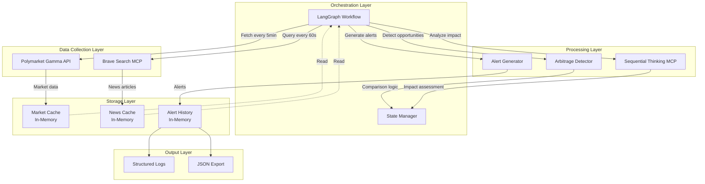
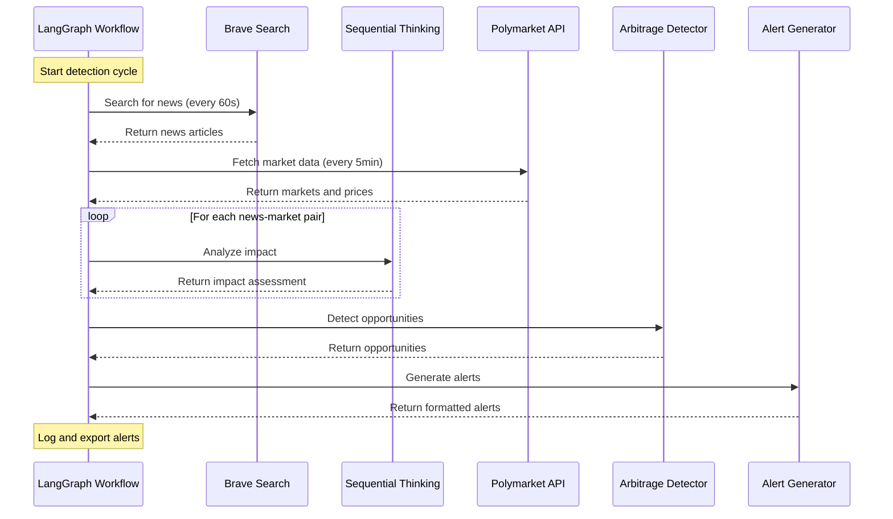
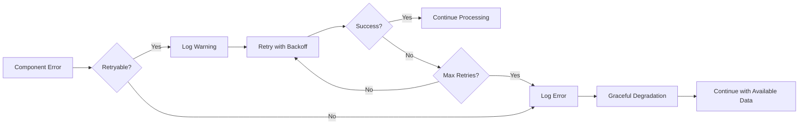
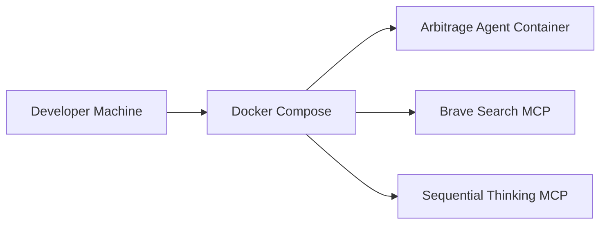
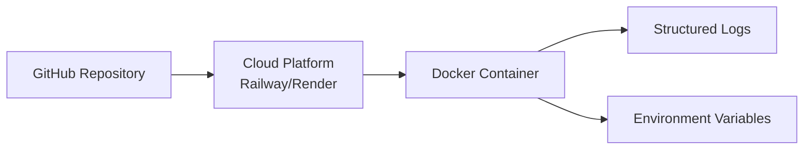

# MVP System Architecture

## Overview

This document describes the architecture for the Polymarket Arbitrage Agent MVP. The system is designed as an event-driven, async workflow that monitors news, reasons about market impact, and detects arbitrage opportunities.

## Architecture Diagram



## Component Responsibilities

### 1. LangGraph Workflow (Orchestration Layer)

**Purpose**: Coordinate the entire arbitrage detection pipeline

**Responsibilities**:
- Manage workflow state (messages, news articles, market data, opportunities)
- Schedule periodic tasks (news search, market refresh)
- Route data between components
- Handle errors and retries
- Execute detection cycles

**Key Methods**:
```python
class ArbitrageDetectionGraph:
    def search_news(state) -> state
    def analyze_impact(state) -> state
    def fetch_markets(state) -> state
    def detect_arbitrage(state) -> state
    def generate_alerts(state) -> state
```

### 2. Brave Search MCP Integration

**Purpose**: Fetch breaking news articles

**Responsibilities**:
- Query Brave Search API with configured search terms
- Parse and normalize news article data
- Deduplicate articles based on URL
- Filter by recency (last 24 hours)
- Handle rate limiting and errors

**Interface**:
```python
class BraveSearchClient:
    async def search(query: str, count: int = 10, freshness: str = "pd") -> list[NewsArticle]:
        """Search for recent news articles."""
```

### 3. Polymarket Gamma API Client

**Purpose**: Fetch market data and prices

**Responsibilities**:
- Fetch list of active markets
- Get current prices for YES/NO tokens
- Cache market data to minimize API calls
- Implement rate limiting
- Handle API errors gracefully

**Interface**:
```python
class PolymarketClient:
    async def get_markets(active: bool = True) -> list[Market]:
        """Fetch list of active markets."""

    async def get_price(token_id: str, side: str) -> float:
        """Fetch current price for a token."""
```

### 4. Sequential Thinking MCP Integration

**Purpose**: Reason about news impact on markets

**Responsibilities**:
- Analyze news article and market description
- Assess relevance (0-1 score)
- Predict price direction (up/down/neutral)
- Generate confidence score (0-1)
- Provide reasoning explanation

**Interface**:
```python
class ReasoningEngine:
    async def analyze_impact(news: NewsArticle, market: Market) -> MarketImpact:
        """Analyze news impact on a market."""
```

### 5. Arbitrage Detector

**Purpose**: Identify price discrepancies

**Responsibilities**:
- Compare expected vs. actual prices
- Calculate discrepancy magnitude
- Apply confidence thresholds
- Filter by minimum profit margin
- Rank opportunities by potential profit

**Interface**:
```python
class ArbitrageDetector:
    def detect_opportunities(impacts: list[MarketImpact], markets: list[Market]) -> list[Opportunity]:
        """Detect arbitrage opportunities."""
```

### 6. Alert Generator

**Purpose**: Create and output alerts

**Responsibilities**:
- Format alerts as structured JSON
- Log alerts to console/file
- Maintain alert history
- Support filtering by severity/confidence
- Export alerts for programmatic use

**Interface**:
```python
class AlertGenerator:
    def generate_alert(opportunity: Opportunity) -> Alert:
        """Generate formatted alert."""

    def export_json(alerts: list[Alert]) -> str:
        """Export alerts as JSON."""
```

## Data Flow

### Main Detection Cycle



### Error Handling Flow



## State Management

### Workflow State (LangGraph)

```python
class ArbitrageState(TypedDict):
    """State for the arbitrage detection workflow."""

    # Input parameters
    search_query: str
    confidence_threshold: float
    min_profit_margin: float

    # Data collected
    news_articles: list[NewsArticle]
    markets: list[Market]
    market_impacts: list[MarketImpact]

    # Results
    opportunities: list[Opportunity]
    alerts: list[Alert]

    # Metadata
    cycle_start_time: datetime
    errors: list[str]
    messages: Annotated[list, operator.add]
```

### In-Memory Caches

**Market Cache**:
```python
{
    "market_id": {
        "data": Market,
        "timestamp": datetime,
        "yes_price": float,
        "no_price": float
    }
}
```
- TTL: 5 minutes
- Refresh: Background task
- Size: ~100 markets

**News Cache**:
```python
{
    "url": {
        "data": NewsArticle,
        "timestamp": datetime,
        "processed": bool
    }
}
```
- TTL: 24 hours
- Deduplication: By URL
- Size: ~50 articles

**Alert History**:
```python
{
    "alert_id": {
        "data": Alert,
        "timestamp": datetime,
        "sent": bool
    }
}
```
- TTL: 24 hours (configurable)
- Max size: 100 alerts
- FIFO eviction

## Technology Stack

### Core Technologies

| Technology | Version | Purpose | Rationale |
|------------|---------|---------|-----------|
| **Python** | 3.11+ | Runtime | Async/await, strong typing, ML ecosystem |
| **LangGraph** | 0.2.0 | Workflow orchestration | Stateful workflows, visual debugging |
| **httpx** | 0.27.0 | Async HTTP client | Performance, async support, modern API |
| **pydantic** | 2.7.0 | Data validation | Type safety, automatic validation |
| **structlog** | 24.1.0 | Structured logging | JSON logs, context management |

### MCP Servers

| MCP Server | Purpose | Integration Method |
|------------|---------|-------------------|
| **Brave Search** | News retrieval | stdio communication |
| **Sequential Thinking** | AI reasoning | stdio communication |

### External APIs

| API | Purpose | Auth | Rate Limit |
|-----|---------|------|------------|
| **Polymarket Gamma** | Market data | None (public) | 10 req/sec |

### Deployment

| Technology | Purpose | Rationale |
|------------|---------|-----------|
| **Docker** | Containerization | Consistency, portability |
| **docker-compose** | Local development | Easy orchestration |
| **Cloud Platform** | Deployment | Railway/Render for simplicity |

## Scalability Considerations

### MVP Limitations

- **Single instance**: No horizontal scaling
- **In-memory state**: No persistence
- **No database**: All data lost on restart
- **No message queue**: Synchronous processing

### Future Scalability Path

1. **Horizontal Scaling**:
   - Add Redis for shared state
   - Use message queue (RabbitMQ/Redis Streams)
   - Run multiple workflow instances

2. **Persistence**:
   - Add PostgreSQL for market/news data
   - Store alert history permanently
   - Enable historical analysis

3. **Performance**:
   - Parallel reasoning with worker pool
   - Batch API calls
   - Add request caching

## Security Architecture

### Threat Model

**Assets to Protect**:
- API keys (Brave Search)
- System logs (may contain sensitive info)
- Alert data (market insights)

**Trust Boundaries**:
- External APIs (untrusted)
- MCP servers (semi-trusted)
- Internal workflow (trusted)

### Security Measures

1. **API Key Management**:
   - Store in environment variables
   - Never log or expose
   - Rotate regularly

2. **Input Validation**:
   - Validate all external data (API responses, MCP output)
   - Sanitize news article content
   - Type checking with Pydantic

3. **Output Sanitization**:
   - Remove API keys from logs
   - Sanitize error messages
   - Mask sensitive data in alerts

4. **Rate Limiting**:
   - Implement client-side rate limiting
   - Respect external API limits
   - Queue requests if needed

## Error Handling Strategy

### Retry Policy

| Error Type | Retry Strategy | Max Attempts | Backoff |
|------------|----------------|--------------|---------|
| Network error | Exponential backoff | 3 | 1s, 2s, 4s |
| API rate limit | Wait + retry | 5 | Retry-After header |
| MCP timeout | No retry (fail fast) | 1 | N/A |
| Invalid data | No retry (log error) | 1 | N/A |

### Error Categories

**Recoverable Errors**:
- Network timeouts
- API rate limits
- Temporary MCP failures

**Non-Recoverable Errors**:
- Invalid configuration
- Missing API keys
- Malformed data

### Degradation Modes

**Full Operation**: All components functional

**Reduced Mode**:
- News search failed: Use cached news
- Reasoning failed: Use simple keyword matching
- Market data failed: Use cached prices

**Minimal Mode**:
- All external services failed: Log error, sleep, retry

## Monitoring and Observability

### Metrics to Track

**System Metrics**:
- Detection cycle duration
- News processing latency
- API call counts and latency
- MCP request latency
- Memory usage

**Business Metrics**:
- Opportunities detected per day
- Alerts generated
- False positive rate (manual validation)
- Average confidence score

### Logging Strategy

**Log Levels**:
- `DEBUG`: Detailed component state
- `INFO`: Normal operations, alerts generated
- `WARNING`: Recoverable errors, retries
- `ERROR`: Non-recoverable errors, component failures

**Log Format** (structured JSON):
```json
{
  "timestamp": "2025-01-12T10:30:00Z",
  "level": "INFO",
  "component": "arbitrage_detector",
  "message": "Opportunity detected",
  "market_id": "market-123",
  "confidence": 0.85,
  "discrepancy": 0.12
}
```

### Health Checks

**Endpoints** (optional, for cloud deployment):
- `GET /health`: Basic health check
- `GET /health/detailed`: Component status
- `GET /metrics`: Prometheus metrics

## Deployment Architecture

### Local Development



### Cloud Deployment (MVP)



**Recommended Platforms**:
1. **Railway** - Simplest, good for small apps
2. **Render** - Good free tier, easy deployment
3. **Google Cloud Run** - Scalable, pay-per-use
4. **AWS ECS** - Enterprise, more complex

### Environment Configuration

```bash
# Required
POLYMARKET_GAMMA_HOST=gamma-api.polymarket.com
BRAVE_API_KEY=sk_***

# Optional (with defaults)
SEARCH_QUERIES="breaking news politics,crypto news,election updates"
CONFIDENCE_THRESHOLD=0.7
MIN_PROFIT_MARGIN=0.05
NEWS_SEARCH_INTERVAL=60
MARKET_REFRESH_INTERVAL=300
LOG_LEVEL=INFO

# MCP Configuration
MCP_BRAVE_SEARCH_ENABLED=true
MCP_SEQUENTIAL_THINKING_ENABLED=true
```

## Testing Strategy

### Unit Tests
- Test individual components in isolation
- Mock external API calls
- Validate business logic

### Integration Tests
- Test MCP integrations
- Test API client (with mock server)
- Test workflow state transitions

### End-to-End Tests
- Test full detection cycle
- Use test doubles for external services
- Validate alert generation

### Performance Tests
- Measure detection cycle latency
- Test with multiple markets
- Verify rate limiting

## Next Steps

After architecture approval:

1. **Developer**: Implement components based on architecture
2. **QA**: Create test plan based on integration points
3. **Security**: Review security architecture
4. **DevOps**: Set up deployment pipeline

---

**Document Version**: 1.0
**Last Updated**: 2025-01-12
**Author**: System Designer Agent
**Status**: Ready for implementation
