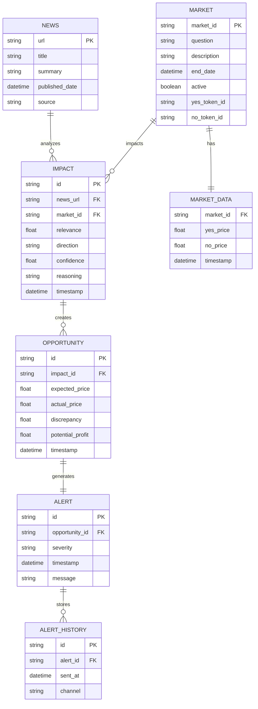
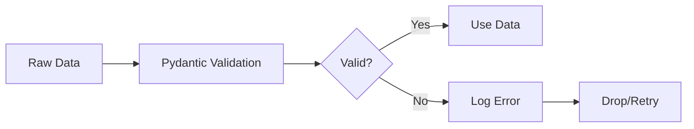

# MVP Data Models and Schemas

## Overview

This document defines all data models used in the Polymarket Arbitrage Agent MVP. All models use Pydantic for validation and serialization.

## Entity Relationship Diagram



## Core Data Models

### 1. News Article

**Purpose**: Represents a news article from Brave Search

```python
from pydantic import BaseModel, Field, HttpUrl
from datetime import datetime
from typing import Optional

class NewsArticle(BaseModel):
    """News article from Brave Search."""

    # Identification
    url: HttpUrl = Field(..., description="Article URL (unique identifier)")
    title: str = Field(..., min_length=1, max_length=500)

    # Content
    summary: str = Field(..., description="Article summary/snippet")
    content: Optional[str] = Field(None, description="Full article content (if available)")

    # Metadata
    published_date: Optional[datetime] = Field(None, description="Publication date")
    source: Optional[str] = Field(None, description="News source name")

    # Processing metadata
    fetched_at: datetime = Field(default_factory=datetime.utcnow)
    processed: bool = Field(default=False, description="Whether analyzed for impact")

    class Config:
        json_encoders = {
            datetime: lambda v: v.isoformat()
        }
```

**Validation Rules**:
- `url`: Must be valid HTTP/HTTPS URL
- `title`: Required, 1-500 characters
- `summary`: Required (from search snippet)
- `published_date`: Optional, parsed from HTML or API
- `source`: Optional, extracted from URL or article

**Indexes**:
- Primary: `url`
- Secondary: `published_date`, `fetched_at`

### 2. Market

**Purpose**: Represents a Polymarket prediction market

```python
class Market(BaseModel):
    """Polymarket prediction market."""

    # Identification
    market_id: str = Field(..., description="Unique market identifier")
    question: str = Field(..., description="Market question")
    description: str = Field(..., description="Detailed market description")

    # Metadata
    end_date: Optional[datetime] = Field(None, description="Market resolution date")
    active: bool = Field(True, description="Whether market is active")

    # Token IDs
    yes_token_id: str = Field(..., description="YES token ID")
    no_token_id: str = Field(..., description="NO token ID")

    # Categories (for filtering)
    tags: list[str] = Field(default_factory=list, description="Market category tags")

    # Cache metadata
    last_updated: datetime = Field(default_factory=datetime.utcnow)

    class Config:
        json_encoders = {
            datetime: lambda v: v.isoformat()
        }
```

**Validation Rules**:
- `market_id`: Required, alphanumeric string
- `question`: Required, human-readable question
- `end_date`: Optional, must be future if active
- `yes_token_id`, `no_token_id`: Required, valid token IDs

**Indexes**:
- Primary: `market_id`
- Secondary: `active`, `end_date`

### 3. Market Data (Price Information)

**Purpose**: Current price data for a market

```python
class MarketData(BaseModel):
    """Current price data for a market."""

    # Identification
    market_id: str = Field(..., description="Market identifier")

    # Prices
    yes_price: float = Field(..., ge=0.0, le=1.0, description="Current YES price")
    no_price: float = Field(..., ge=0.0, le=1.0, description="Current NO price")

    # Spread
    bid_price: Optional[float] = Field(None, ge=0.0, le=1.0)
    ask_price: Optional[float] = Field(None, ge=0.0, le=1.0)

    # Metadata
    timestamp: datetime = Field(default_factory=datetime.utcnow)
    source: str = Field(default="polymarket_gamma")

    @property
    def spread(self) -> float:
        """Calculate bid-ask spread."""
        if self.bid_price and self.ask_price:
            return self.ask_price - self.bid_price
        return 0.0

    @property
    def implied_probability(self) -> float:
        """Calculate implied probability from yes price."""
        return self.yes_price

    class Config:
        json_encoders = {
            datetime: lambda v: v.isoformat()
        }
```

**Validation Rules**:
- `yes_price`, `no_price`: Required, 0.0-1.0 range
- `bid_price`, `ask_price`: Optional, 0.0-1.0 range
- Prices should sum to ~1.0 (within tolerance)

**Relationships**:
- Many-to-One with `Market`

### 4. Market Impact Assessment

**Purpose**: AI reasoning about news impact on a market

```python
from enum import Enum

class PriceDirection(str, Enum):
    """Expected price direction."""
    UP = "up"
    DOWN = "down"
    NEUTRAL = "neutral"

class MarketImpact(BaseModel):
    """Assessment of news impact on a market."""

    # Identification
    id: str = Field(..., description="Unique impact identifier")
    news_url: HttpUrl = Field(..., description="Related news article")
    market_id: str = Field(..., description="Affected market")

    # AI reasoning results
    relevance: float = Field(
        ...,
        ge=0.0,
        le=1.0,
        description="Relevance score (0-1)"
    )
    direction: PriceDirection = Field(
        ...,
        description="Expected price direction"
    )
    confidence: float = Field(
        ...,
        ge=0.0,
        le=1.0,
        description="Confidence in assessment (0-1)"
    )
    reasoning: str = Field(
        ...,
        min_length=10,
        max_length=1000,
        description="Explanation of the impact"
    )

    # Expected price change
    expected_magnitude: float = Field(
        ...,
        ge=0.0,
        le=1.0,
        description="Expected price change magnitude"
    )
    expected_price: float = Field(
        ...,
        ge=0.0,
        le=1.0,
        description="Expected new price after impact"
    )

    # Metadata
    timestamp: datetime = Field(default_factory=datetime.utcnow)
    model: str = Field(default="sequential_thinking_mcp")

    @property
    def is_significant(self) -> bool:
        """Whether impact is significant (relevance > 0.5)."""
        return self.relevance > 0.5

    @property
    def is_high_confidence(self) -> bool:
        """Whether assessment is high confidence (>= 0.7)."""
        return self.confidence >= 0.7

    class Config:
        json_encoders = {
            datetime: lambda v: v.isoformat()
        }
        use_enum_values = True
```

**Validation Rules**:
- `relevance`: 0.0-1.0, required
- `confidence`: 0.0-1.0, required
- `direction`: Must be valid enum value
- `reasoning`: 10-1000 characters

**Relationships**:
- Many-to-One with `NewsArticle` (via `news_url`)
- Many-to-One with `Market` (via `market_id`)

### 5. Arbitrage Opportunity

**Purpose**: Detected price discrepancy

```python
class Opportunity(BaseModel):
    """Arbitrage opportunity detected."""

    # Identification
    id: str = Field(..., description="Unique opportunity identifier")
    impact_id: str = Field(..., description="Related impact assessment")

    # Market information
    market_id: str = Field(..., description="Affected market")
    market_question: str = Field(..., description="Market question")

    # Price information
    current_price: float = Field(..., ge=0.0, le=1.0)
    expected_price: float = Field(..., ge=0.0, le=1.0)
    discrepancy: float = Field(..., ge=0.0, le=1.0, description="Price difference")

    # Profitability
    potential_profit: float = Field(..., ge=0.0, description="Expected profit %")
    confidence: float = Field(..., ge=0.0, le=1.0, description="Assessment confidence")

    # Action recommendation
    action: str = Field(..., description="Recommended action: 'watch', 'monitor', 'investigate'")

    # Metadata
    timestamp: datetime = Field(default_factory=datetime.utcnow)
    expires_at: Optional[datetime] = Field(None, description="When opportunity expires")

    @property
    def is_profitable(self) -> bool:
        """Whether opportunity meets minimum profit threshold."""
        from src.utils.config import settings
        return self.potential_profit >= settings.min_profit_margin

    @property
    def is_high_confidence(self) -> bool:
        """Whether opportunity is high confidence."""
        return self.confidence >= 0.7

    @property
    def age_seconds(self) -> float:
        """Age of opportunity in seconds."""
        return (datetime.utcnow() - self.timestamp).total_seconds()

    class Config:
        json_encoders = {
            datetime: lambda v: v.isoformat()
        }
```

**Validation Rules**:
- `discrepancy`: >= 0.0, required
- `potential_profit`: >= 0.0, calculated as `discrepancy * confidence`
- `action`: Must be one of: 'watch', 'monitor', 'investigate'

**Relationships**:
- Many-to-One with `MarketImpact` (via `impact_id`)
- One-to-One with `Alert`

### 6. Alert

**Purpose**: Human-readable alert for an opportunity

```python
class AlertSeverity(str, Enum):
    """Alert severity levels."""
    INFO = "INFO"
    WARNING = "WARNING"
    CRITICAL = "CRITICAL"

class Alert(BaseModel):
    """Alert generated for an opportunity."""

    # Identification
    id: str = Field(..., description="Unique alert identifier")
    opportunity_id: str = Field(..., description="Related opportunity")

    # Severity
    severity: AlertSeverity = Field(..., description="Alert severity")

    # Content
    title: str = Field(..., min_length=1, max_length=200)
    message: str = Field(..., min_length=1, max_length=2000)

    # Detailed information
    news_url: HttpUrl = Field(..., description="Related news article")
    news_title: str = Field(..., description="News article title")

    market_id: str = Field(..., description="Affected market")
    market_question: str = Field(..., description="Market question")

    # Reasoning
    reasoning: str = Field(..., description="AI reasoning for impact")
    confidence: float = Field(..., ge=0.0, le=1.0)

    # Price details
    current_price: float = Field(..., ge=0.0, le=1.0)
    expected_price: float = Field(..., ge=0.0, le=1.0)
    discrepancy: float = Field(..., ge=0.0, le=1.0)

    # Action
    recommended_action: str = Field(..., description="Recommended action")

    # Metadata
    timestamp: datetime = Field(default_factory=datetime.utcnow)

    @classmethod
    def from_opportunity(cls, opportunity: Opportunity, news: NewsArticle, market: Market) -> "Alert":
        """Create alert from opportunity."""
        # Determine severity based on confidence and profit
        if opportunity.confidence >= 0.8 and opportunity.potential_profit >= 0.1:
            severity = AlertSeverity.CRITICAL
        elif opportunity.confidence >= 0.7 and opportunity.potential_profit >= 0.05:
            severity = AlertSeverity.WARNING
        else:
            severity = AlertSeverity.INFO

        return cls(
            id=f"alert-{datetime.utcnow().timestamp()}",
            opportunity_id=opportunity.id,
            severity=severity,
            title=f"Arbitrage opportunity: {market.question[:50]}...",
            message=f"News '{news.title}' suggests price should move {opportunity.expected_price > opportunity.current_price and 'up' or 'down'} from {opportunity.current_price:.2f} to {opportunity.expected_price:.2f} (discrepancy: {opportunity.discrepancy:.2%})",
            news_url=news.url,
            news_title=news.title,
            market_id=market.market_id,
            market_question=market.question,
            reasoning=opportunity.expected_price,  # Will be populated from impact
            confidence=opportunity.confidence,
            current_price=opportunity.current_price,
            expected_price=opportunity.expected_price,
            discrepancy=opportunity.discrepancy,
            recommended_action=opportunity.action
        )

    class Config:
        json_encoders = {
            datetime: lambda v: v.isoformat()
        }
        use_enum_values = True
```

**Validation Rules**:
- `severity`: Must be valid enum value
- `title`: 1-200 characters
- `message`: 1-2000 characters

## Workflow State Model

### ArbitrageDetectionGraph State

```python
from typing import Annotated, TypedDict
import operator

class ArbitrageState(TypedDict):
    """State for the arbitrage detection workflow."""

    # Configuration (input)
    search_query: str
    confidence_threshold: float
    min_profit_margin: float

    # Data collected
    news_articles: list[NewsArticle]
    markets: list[Market]
    market_data: dict[str, MarketData]  # market_id -> MarketData
    market_impacts: list[MarketImpact]

    # Results
    opportunities: list[Opportunity]
    alerts: list[Alert]

    # Metadata
    cycle_start_time: datetime
    cycle_end_time: Optional[datetime]
    errors: list[str]
    messages: Annotated[list[dict], operator.add]  # Accumulated messages
```

## MCP Request/Response Models

### Brave Search Request

```python
class BraveSearchRequest(BaseModel):
    """Request to Brave Search MCP."""

    query: str = Field(..., description="Search query")
    count: int = Field(default=10, ge=1, le=50, description="Number of results")
    freshness: str = Field(default="pd", description="Time filter: pd (day), pw (week), pm (month)")
    offset: int = Field(default=0, ge=0, description="Pagination offset")
```

### Brave Search Response

```python
class BraveSearchResponse(BaseModel):
    """Response from Brave Search MCP."""

    results: list[NewsArticle] = Field(default_factory=list)
    total_results: Optional[int] = Field(None)
    query: str
    timestamp: datetime = Field(default_factory=datetime.utcnow)
```

### Sequential Thinking Request

```python
class SequentialThinkingRequest(BaseModel):
    """Request to Sequential Thinking MCP."""

    news_article: str = Field(..., description="News article content/title/summary")
    market_description: str = Field(..., description="Market question and description")
    market_end_date: Optional[datetime] = Field(None, description="Market resolution date")
    context: Optional[str] = Field(None, description="Additional context")
```

### Sequential Thinking Response

```python
class SequentialThinkingResponse(BaseModel):
    """Response from Sequential Thinking MCP."""

    relevance: float = Field(..., ge=0.0, le=1.0, description="Relevance to market")
    direction: PriceDirection = Field(..., description="Expected price direction")
    confidence: float = Field(..., ge=0.0, le=1.0, description="Confidence in assessment")
    reasoning: str = Field(..., description="Explanation of impact")
    expected_magnitude: float = Field(..., ge=0.0, le=1.0, description="Expected price change magnitude")

    @property
    def expected_price(self, current_price: float) -> float:
        """Calculate expected price based on direction and magnitude."""
        if self.direction == PriceDirection.UP:
            return min(current_price + self.expected_magnitude, 1.0)
        elif self.direction == PriceDirection.DOWN:
            return max(current_price - self.expected_magnitude, 0.0)
        else:
            return current_price
```

## Data Validation Pipeline



### Validation Example

```python
from pydantic import ValidationError

def validate_news_article(raw_data: dict) -> NewsArticle:
    """Validate and create NewsArticle from raw data."""
    try:
        return NewsArticle(**raw_data)
    except ValidationError as e:
        logger.error("validation_error", errors=e.errors(), data=raw_data)
        raise

# Usage
try:
    article = validate_news_article(raw_api_response)
except ValidationError:
    # Handle invalid data
    pass
```

## JSON Schema Examples

### News Article JSON Schema

```json
{
  "$schema": "http://json-schema.org/draft-07/schema#",
  "type": "object",
  "title": "NewsArticle",
  "required": ["url", "title", "summary"],
  "properties": {
    "url": {
      "type": "string",
      "format": "uri"
    },
    "title": {
      "type": "string",
      "minLength": 1,
      "maxLength": 500
    },
    "summary": {
      "type": "string"
    },
    "content": {
      "type": "string"
    },
    "published_date": {
      "type": "string",
      "format": "date-time"
    },
    "source": {
      "type": "string"
    },
    "fetched_at": {
      "type": "string",
      "format": "date-time"
    },
    "processed": {
      "type": "boolean"
    }
  }
}
```

### Market JSON Schema

```json
{
  "$schema": "http://json-schema.org/draft-07/schema#",
  "type": "object",
  "title": "Market",
  "required": ["market_id", "question", "description", "yes_token_id", "no_token_id"],
  "properties": {
    "market_id": {
      "type": "string"
    },
    "question": {
      "type": "string"
    },
    "description": {
      "type": "string"
    },
    "end_date": {
      "type": "string",
      "format": "date-time"
    },
    "active": {
      "type": "boolean"
    },
    "yes_token_id": {
      "type": "string"
    },
    "no_token_id": {
      "type": "string"
    },
    "tags": {
      "type": "array",
      "items": {
        "type": "string"
      }
    },
    "last_updated": {
      "type": "string",
      "format": "date-time"
    }
  }
}
```

## Data Serialization

### JSON Export

```python
import json

def export_alerts(alerts: list[Alert], filepath: str):
    """Export alerts to JSON file."""
    data = [alert.model_dump(mode="json") for alert in alerts]
    with open(filepath, "w") as f:
        json.dump(data, f, indent=2, default=str)

def import_alerts(filepath: str) -> list[Alert]:
    """Import alerts from JSON file."""
    with open(filepath, "r") as f:
        data = json.load(f)
    return [Alert(**alert) for alert in data]
```

### Logging Format

```python
def log_alert(alert: Alert):
    """Log alert in structured format."""
    logger.info(
        "alert_generated",
        alert_id=alert.id,
        severity=alert.severity,
        market_id=alert.market_id,
        confidence=alert.confidence,
        discrepancy=alert.discrepancy,
        timestamp=alert.timestamp.isoformat()
    )
```

---

**Document Version**: 1.0
**Last Updated**: 2025-01-12
**Author**: System Designer Agent
**Status**: Ready for implementation
